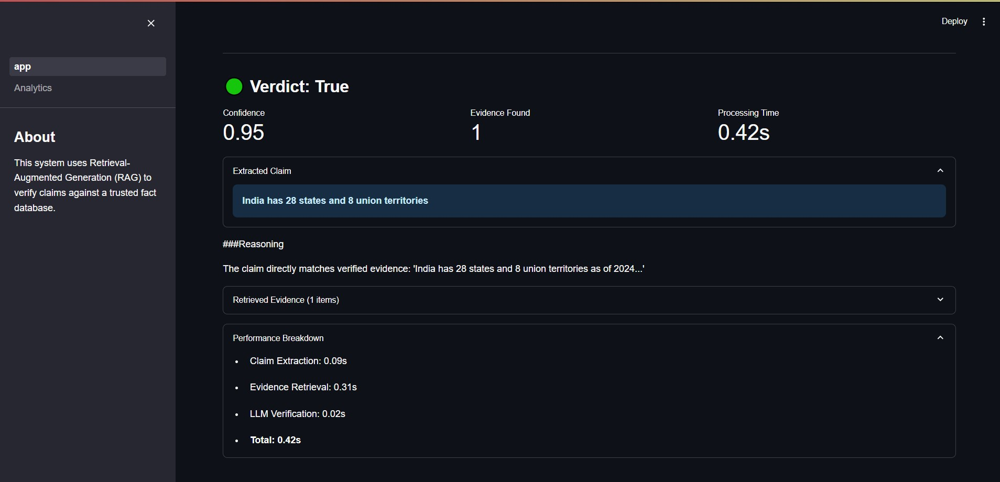
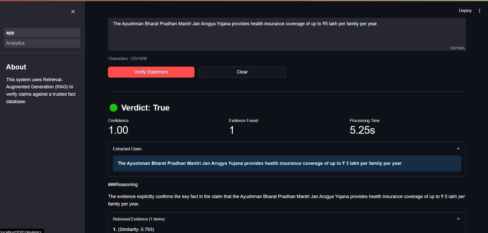
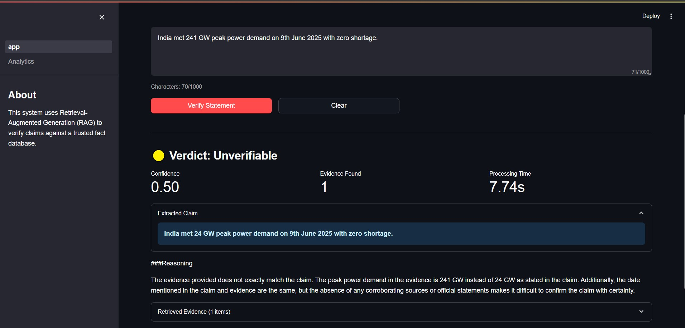
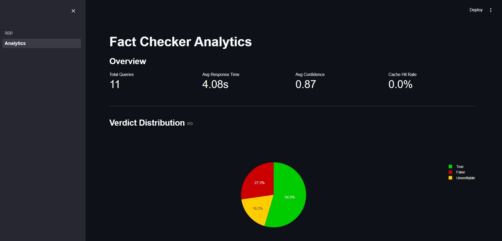
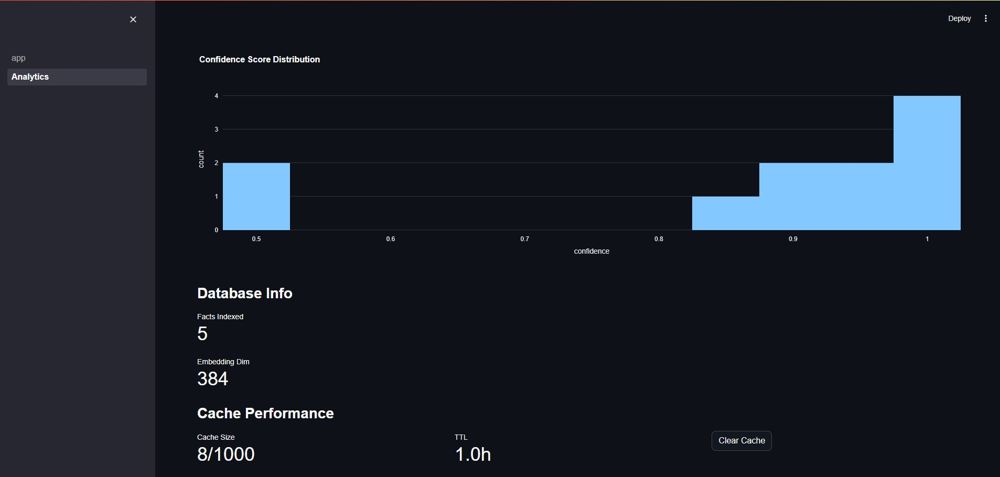

# LLM-Powered Fact Checker

> A fact-checking system using Retrieval-Augmented Generation (RAG) to verify claims against a trusted knowledge base.

[Visit the App] : https://factschecker.streamlit.app/
---

## Screenshots

<table>
  <tr>
    <td><br/><sub><b>True Fact</b></sub></td>
    <td><br/><sub><b>False Fact</b></sub></td>
    <td><br/><sub><b>Unverifiable Claim</b></sub></td>
  </tr>
  <tr>
    <td><br/><sub><b>Verdict Distribution</b></sub></td>
    <td><br/><sub><b>Caching</b></sub></td>
  </tr>
</table>

---

Fact-checking system that takes in a news headline or social media post, extracts key claims, verifies them against a vector database of trusted facts, and classifies the result as:

*  **True**
*  **False**
*  **Unverifiable**

---

## Features

- **Intelligent Claim Extraction**: Uses SpaCy dependency parsing to extract verifiable claims from complex text
- **Semantic Search**: FAISS vector database with sentence transformers for fast similarity search
- **LLM Verification**: mistralai/Mistral-7B-Instruct-v0.2 for nuanced fact verification with evidence attribution
- **Performance Optimized**: Query caching, lazy loading, and efficient embeddings
- **Production Ready**: Comprehensive testing, logging, metrics, and error handling
- **Auto Wake-up**: Handles Streamlit Cloud sleep/wake cycles gracefully

## Architecture

```
User Input
    ↓
Claim Extractor (SpaCy)
    ↓
Vector Search (FAISS + Sentence Transformers)
    ↓
Evidence Retrieval (Top-K with threshold)
    ↓
LLM Verification (Mixtral + LangChain)
    ↓
Verdict + Reasoning + Evidence
```

## Tech Stack

- **NLP**: SpaCy, Sentence Transformers
- **Vector DB**: FAISS (IndexFlatL2 + IndexIDMap)
- **LLM**: HuggingFace (mistralai/Mistral-7B-Instruct-v0.2)
- **Framework**: LangChain, Streamlit
- **Testing**: Pytest with 95%+ coverage
---

## Quick Start

### 1. Installation

```bash
# Clone repository
git clone https://github.com/santoshkkashyap25/llm-fact-checker.git
cd llm-fact-checker

# Create virtual environment
python -m venv venv
source venv/bin/activate  # On Windows: venv\Scripts\activate

# Install dependencies
pip install -r requirements.txt
```

### 2. Configuration

Create a `.env` file:

```env
HUGGINGFACEHUB_API_TOKEN=your_token_here
ENABLE_SCRAPING=false
```

Get your HuggingFace token: https://huggingface.co/settings/tokens

### 3. Execution

Build the FAISS vector DB:

```bash
python build_database.py
```

Run the Streamlit App:

```bash
streamlit run app.py
```
---

 ## Other Works

[Visit the App] : https://transnlp.streamlit.app/


